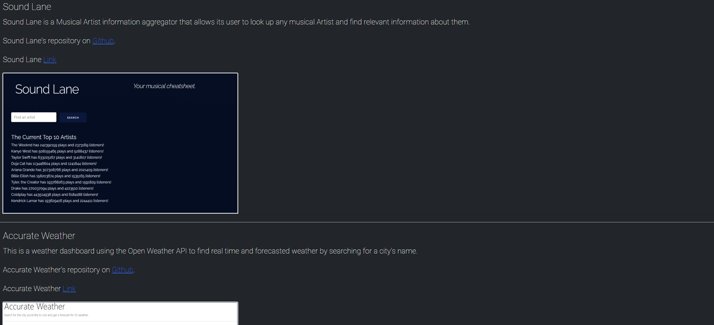

# portfolio-t2
This is my second crack at a professional personal portfolio. I have slightly more skill under my wing, and while I have a ways to go. This was a good place to to revisit it.

# Deployed Link:
https://mchambersiv.github.io/portfolio-t2/

##
The navigation bar includes links to my github page and LinkedIn

##
I have included several projects I've worked on thus far that I am pretty happy with that also showcase some of what I've learned.
Each has a section has a screen of the project's page on load and a link to it's respective repository.

##
I've included a Contact Me section at the bottom of the page so anyone interested in reaching out to me can.
Conceptually, at least. I feel I have a ways to go before I'm ready to be reached out to so I've just created to some placeholders in the real information's stead.

##
This site is and will continue to be actively worked on so feel free to pop in every so often and judge the changes and additions I've made. Thank you for reading this far!
